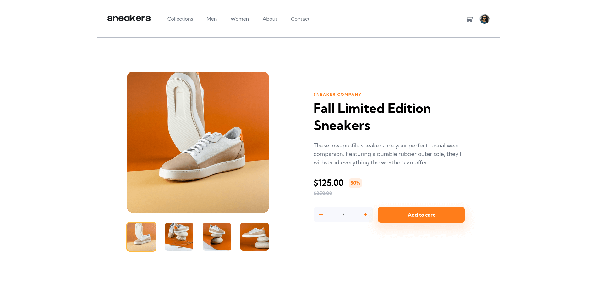
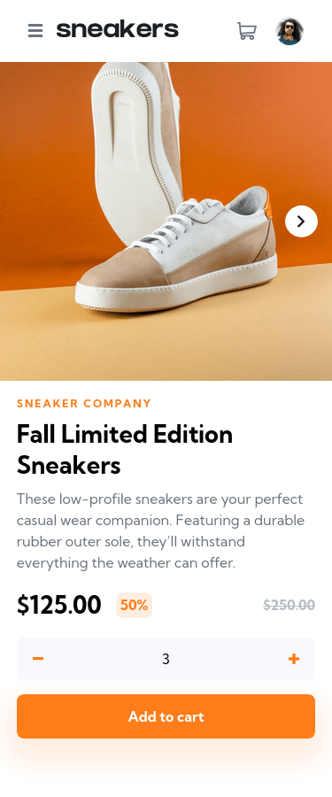

# Frontend Mentor - E-commerce product page solution

This is a solution to the [E-commerce product page challenge on Frontend Mentor](https://www.frontendmentor.io/challenges/ecommerce-product-page-UPsZ9MJp6). Frontend Mentor challenges help you improve your coding skills by building realistic projects.

## Table of contents

- [Overview](#overview)
  - [The challenge](#the-challenge)
  - [Screenshot](#screenshot)
  - [Links](#links)
- [My process](#my-process)
  - [Built with](#built-with)
  - [What I learned](#what-i-learned)
  - [Continued development](#continued-development)
  - [Useful resources](#useful-resources)
- [Author](#author)
- [Acknowledgments](#acknowledgments)

## Overview

### The challenge

Users should be able to:

- View the optimal layout for the site depending on their device's screen size
- See hover states for all interactive elements on the page
- Open a lightbox gallery by clicking on the large product image (I don't do it, sorry).
- Switch the large product image by clicking on the small thumbnail images
- Add items to the cart
- View the cart and remove items from it

### Screenshot
<br>
<h4>Desktop</h3>



<h4>Mobile</h3>




### Links

- Solution URL: [You are here right now!](https://github.com/ZeroBl21/ecommerce-product-page)
- Live Site URL: [Do you wanna see more? Click Me!](https://your-live-site-url.com)

## My process

### Built with

- Semantic HTML5 markup
- Pure CSS
- Flexbox
- CSS Grid
- Vanilla JavaScript
- Mobile-first workflow
- [Normalize.css](https://necolas.github.io/normalize.css/) - For reset styles

### What I learned

I learned so much how to simplify my class names for CSS with the [BEM Methodology](https://en.bem.info/methodology/) and forced myself to hard work with JS in things like Menus and the Carousel, until i met the [Data-Attributes](https://developer.mozilla.org/en-US/docs/Learn/HTML/Howto/Use_data_attributes), that helped me so much to do it.

In this project i made some changes to the original one, improvements from my point of view, like some size changes in the design, i'm really proud of that and my CSS skills.

To see how you can add code snippets, see below:

you can see the tutorial for this thing [Clicking Here](https://i.ytimg.com/an_webp/VYsVOamdB0g/mqdefault_6s.webp?du=3000&sqp=CPiJ-5AG&rs=AOn4CLBxe1u6xDXYtZSzwWSBeABm9eYszA)
```html
<!-- This Big boy is a pain to do, but works -->
<section class="main-carousel">
  <div class="carousel">
    <button class="btn carousel__button carousel__button--left hidden"></button>

    <div class="carousel__track-container">
      <ul class="carousel__track">
        <li class="carousel__slide current-slide">
          
        </li>
        <li class="carousel__slide">
          
        </li>
        <li class="carousel__slide">
          
        </li>
        <li class="carousel__slide">
          
        </li>
      </ul>
    </div>

    <button class="btn carousel__button carousel__button--right"></button>

    <div class="carousel__nav">
      <button class="btn carousel__indicator current-slide">
        
      </button>

      <button class="btn carousel__indicator">
        
      </button>

      <button class="btn carousel__indicator">
        
      </button>

      <button class="btn carousel__indicator">
        
      </button>
    </div>
  </div>
</section>
```

```css
/* These Are The real MVPs */
body {
  font-family: "Kumbh Sans", sans-serif;

  min-height: 100vh;
  width: min(100%, 1280px);
  margin: 0 auto;

  overflow-x: hidden;
  line-height: 1.5;
}

.btn {
  border: 0;
  background-color: transparent;
  cursor: pointer;

  background-repeat: no-repeat;
  background-size: 12px;
  background-position: center;
  width: 1rem;
  height: 1rem;
}

.principal-nav[data-visible="true"] {
  transform: translateX(0);
  font-weight: bold;
}

min() - clamp() - margin: auto /*<--- I love this properties now*/
```

### Continued development

I will do my next project with a Js framework like [React](https://es.reactjs.org/) or [Vue](https://vuejs.org/) and try some CSS preprocessor and frameworks like [PostCss](https://postcss.org/) and [TailWind](https://tailwindcss.com/), i really enjoy do Vanilla CSS, but looks like a good idea try a thing that boost my development speed to these things.

### Useful resources

- [Kevin Powell (Youtube)](https://www.youtube.com/kepowob) - This helped me to improve my CSS skills, his videos are amazing, i really liked his methods and will use it going forward.


## Author

- Website - [La Esquina de Zero](https://zerobl21.github.io/Portfolio/)
- Frontend Mentor - [@ZeroBl21](https://www.frontendmentor.io/profile/ZeroBl21)
- Twitter - [@ZeroBlackFenix](https://twitter.com/zeroblackfenix)
- LinkedIn - [Zero](https://www.linkedin.com/in/darwin-josue-p-461222233/)


## Acknowledgments

It's okay to ask for help when you don't know something. <br>
It's okay to google when you have trouble. <br>
It's okay to have bugs in the code, and be spaghetti.

Just keep one thing in mind, if you don't try, your odds will always drop to 0%.

Never Stop Learning.